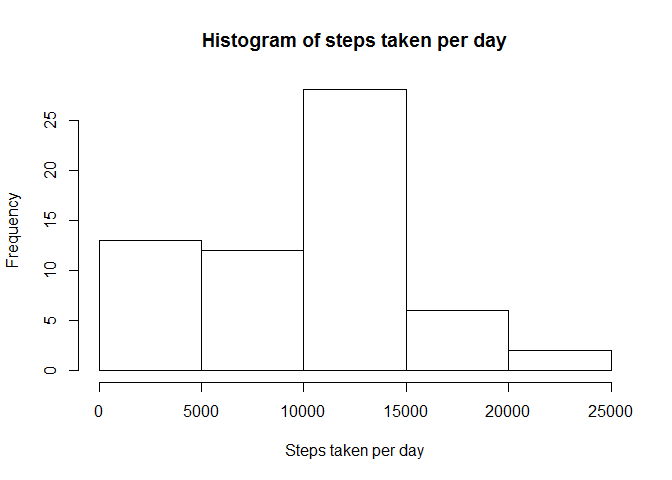
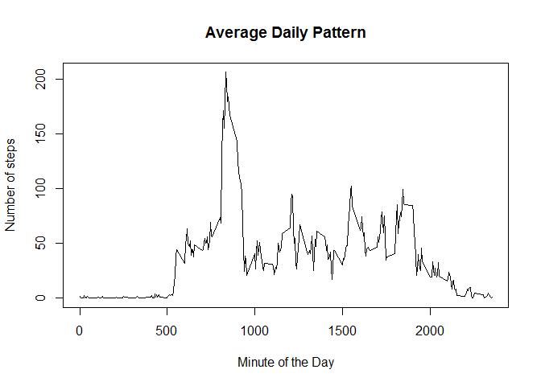
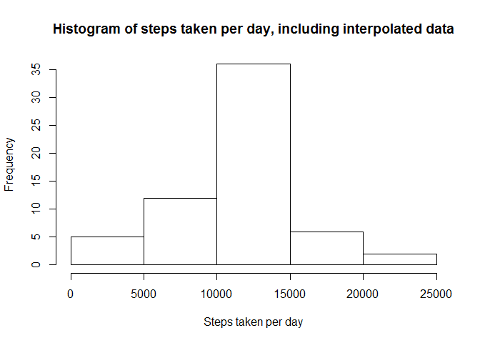
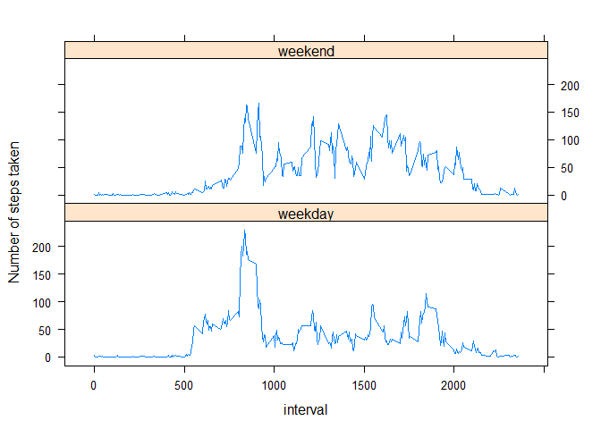

# Reproducible Research: Peer Assessment 1

##Loading and preprocessing the data

```r
##Load in the data ignoring .na values
setwd("C:\\Software\\R\\Coursera\\Reproducible_Research")
data <- read.csv("activity.csv", header = T, sep = ",")
steps <- tapply(data$steps, data$date, sum, na.rm=T)
```

##What is mean total number of steps taken per day?


```r
#Create a histogram of the steps taken per day
hist(steps, xlab = "Steps taken per day", main = "Histogram of steps taken per day")
```



 
##Calculate and report the mean and median total number of steps taken per day
The mean step count per day is: 

```r
meanSteps <- mean(steps)
print(round(meanSteps))
```

```
## [1] 9354
```

The median step count per day is:

```r
medianSteps <- median(steps)
print(round(medianSteps))
```

```
## [1] 10395
```


## What is the average daily activity pattern?

```r
#Create a line plot of the Average daily pattern
meanInterval<- tapply(data$steps, data$interval, mean, na.rm=T)
plot(meanInterval ~ unique(data$interval), type="l", xlab = "Minute of the Day"
			, ylab = "Number of steps", main = "Average Daily Pattern")
```



```r
#Obtain highest step 5-min interval
maxInterval <- meanInterval[which.max(meanInterval)]
print(maxInterval)
```

```
##      835 
## 206.1698
```

## Imputing missing values.

```r
##Strategy to fill in missing (NA) values.
interpolatedData <- data
for (i in 1:nrow(data)){
    if(is.na(data$steps[i])){
        interpolatedData$steps[i]<- meanInterval[[as.character(data[i, "interval"])]]
    }
}
stepsInterpolated <- tapply(interpolatedData $steps, interpolatedData $date, sum, na.rm=T)

#Create 2nd histogram of steps per day that include the interpolated data
hist(stepsInterpolated , xlab = "Steps taken per day", main = "Histogram of steps taken per day, including interpolated data")
```




The new mean number of steps per day is:

```r
round(mean(stepsInterpolated ))
```

```
## [1] 10766
```
The new mean number of steps per day is:

```r
round(median(stepsInterpolated ))
```

```
## [1] 10766
```
By including interpolated data we have added additional steps equal to:

```r
round(abs(sum(data[,1],na.rm = T)-sum(interpolatedData[,1],na.rm = T)))
```

```
## [1] 86130
```


## Are there differences in activity patterns between weekdays and weekends?
The simple answer is yes, there is a difference between the activity patters of people during the week and weekend

```r
#First we need to add an additional field to the data and fill it with the factor of either "weekday" or "weekend"
interpolatedData$weekday <- c("weekday")
interpolatedData[weekdays(as.Date(interpolatedData[, 2])) %in% c("Saturday", "Sunday"), ][4] <- c("weekend")
interpolatedData$weekday <- factor(interpolatedData$weekday)

weekend <- subset(interpolatedData, interpolatedData$weekday == "weekend")
weekday <- subset(interpolatedData, interpolatedData$weekday == "weekday")

mean_weekday <- tapply(weekday$steps, weekday$interval, mean)
mean_weekend <- tapply(weekend$steps, weekend$interval, mean)
#Next we need to graphically display the different patterns as well as importing the lattics package
library(lattice)
df_weekday <- data.frame(interval = unique(weekday$interval), avg = as.numeric(mean_weekday), day = rep("weekday", length(mean_weekday)))
df_weekend <- data.frame(interval = unique(weekend$interval), avg = as.numeric(mean_weekend), day = rep("weekend", length(mean_weekend)))
df_final <- rbind(df_weekday, df_weekend)

xyplot(avg ~ interval | day, data = df_final, layout = c(1, 2), type = "l", ylab = "Number of steps taken")
```



##From these graphs we can see that people take more steps during the morning and fewer steps during the afternoon on the weekends than they do during the week.
